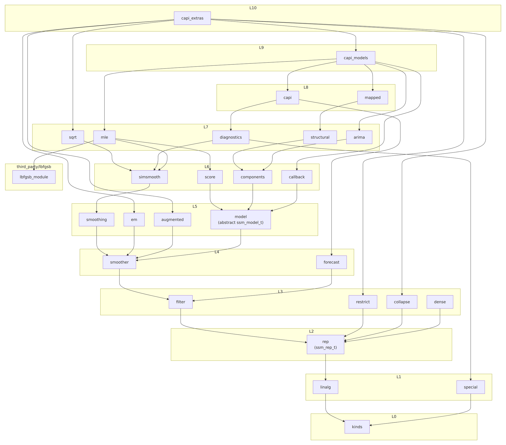

Dependency tree
===============

The chart shows how the Fortran modules in ``src/`` interact. An arrow from
one module to another means the first module uses the second. The
``statespace_`` prefix is omitted from module names.

